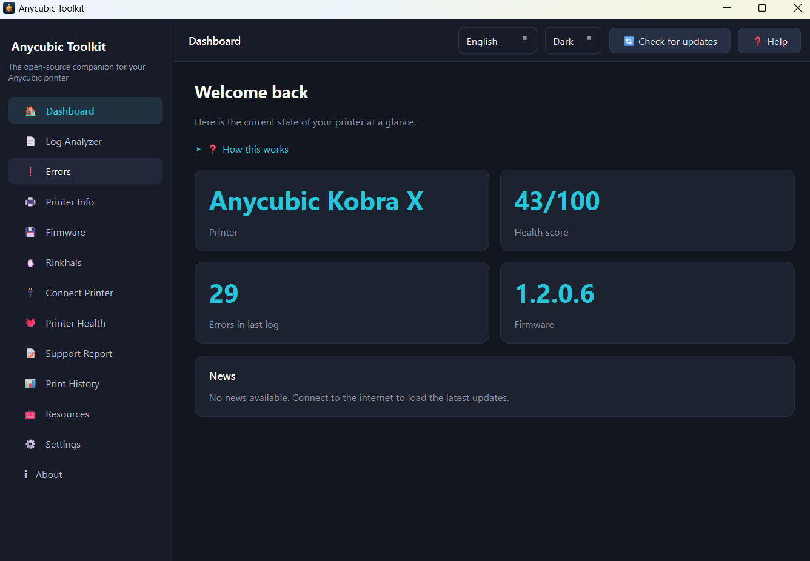

# Anycubic Toolkit

A free, open-source desktop companion for owners of Anycubic 3D printers.
Analyze printer logs, look up error codes, track firmware, monitor printer
health and extend everything with plugins — all in a modern, cross-platform
Qt interface.

> Not affiliated with Anycubic. Built by the community, for the community.

## Features

- **Log Analyzer** — drop an `AC_LOG.pack` file; it is unlocked and analyzed
  **entirely on your machine**. Your logs never leave your computer — only the
  password database is downloaded. See the detected printer, firmware, errors,
  warnings, a health score and suggested fixes.
- **Error Code Lookup** — type an Anycubic error code (e.g. `11518`) and get its
  description and summary, fetched **directly from the Anycubic Wiki** page for
  that code, with a link to the full troubleshooting guide.
- **Printer Information** — model, serial number and firmware detected from your
  last analysis.
- **Firmware Center** — firmware downloads pulled **directly from the official
  Anycubic firmware & software page**, with one-click downloads and a link to
  the official page.
- **Printer Health** — overall and per-component scores (extruder, ACE, bed,
  temperature, fans, motors).
- **Support Report** — bundle your analysis into a shareable text report for
  support tickets (no raw logs included).
- **Resources & Tools** — curated links for Anycubic owners: 3D model
  libraries (Makeronline, MakerWorld, Printables, Thingiverse), AI model
  generators (Meshy and alternatives), compatible slicers (Anycubic Slicer
  Next, OrcaSlicer, Cura, PrusaSlicer, Bambu Studio) and official Anycubic
  links — each opened in the browser.
- **Settings** — language, theme, update channel, auto-update and folders.
- **Dark & light themes**, live language switching (no restart), and a plugin
  system for extending the app.

Bundled languages: English, Svenska, Español, Português. Adding a language is
as simple as dropping a JSON file into `resources/i18n/` (see below).

## Screenshots

_Screenshots go here once the first release is tagged._

<!--


-->

## Install

### Windows

Download the latest `AnycubicToolkit-*-windows-x64.zip` from the
[Releases](https://github.com/wizz666/anycubic-toolkit/releases) page, verify
the `.sha256` checksum, unzip and run `AnycubicToolkit.exe`. No installation
required.

### From source (any platform)

```bash
git clone https://github.com/wizz666/anycubic-toolkit.git
cd anycubic-toolkit
python -m venv .venv
source .venv/bin/activate        # Windows: .venv\Scripts\activate
pip install -r requirements.txt
python -m anycubic_toolkit
```

Requires Python 3.12+.

## Development

The project uses a `src/` layout. Core services (configuration, translations,
theming, networking, plugins, log analysis) live in
`src/anycubic_toolkit/core/` and are deliberately Qt-light so they are easy to
test. The user interface lives in `src/anycubic_toolkit/ui/`.

```bash
pip install -r requirements.txt
python -m anycubic_toolkit          # run
python -m compileall src plugins    # quick sanity check
pyinstaller anycubic_toolkit.spec   # build a standalone executable
```

### Adding a language

Copy `src/anycubic_toolkit/resources/i18n/en.json` to `<code>.json` (for
example `de.json`), translate the values and restart. The new language appears
automatically in the language selector — no code changes needed.

### Writing a plugin

A plugin is a folder with three items:

```
my_plugin/
    plugin.json        # metadata
    main.py            # defines create_plugin(context) -> ToolkitPlugin
    resources/
        icon.png       # optional 48x48 icon
```

`main.py` must define a `create_plugin(context)` factory returning a
`ToolkitPlugin`. Override `create_page()` to contribute a sidebar page. The
`context` dict provides shared services: `config`, `translator`, `theme`, `api`
and `app_version`. See `plugins/sample_hello/` for a complete example.

Drop the folder into `plugins/` (bundled) or your user plugin directory. The
app loads bundled and user plugins on startup. (A one-click plugin marketplace
is planned for a later version.)

## wizz.se backend

The Toolkit talks to a small REST API served by a WordPress plugin on
`https://wizz.se`, namespaced under `/wp-json/anycubic-toolkit/v1`. It hosts
**only** the log-password database and the app's own news/update channel — no
printer error or firmware data is mirrored here:

| Endpoint            | Purpose                                             |
| ------------------- | --------------------------------------------------- |
| `/keys`             | password database for `AC_LOG.pack` archives        |
| `/news`             | dashboard news feed                                 |
| `/updates`          | application update manifest (`?channel=`)           |

Every response is cached on disk, so the app remains usable offline with the
last-known data.

## External sources (direct from Anycubic)

Error codes and firmware are fetched **straight from Anycubic's own sites** —
never mirrored through wizz.se:

| Source                     | Used by            | How it's fetched                               |
| -------------------------- | ------------------ | ---------------------------------------------- |
| Anycubic Wiki error codes  | Error Code Lookup  | direct fetch of the per-code page `.../en/error-codes/{code}-code` (server-rendered) |
| Anycubic firmware/software | Firmware Center    | direct fetch of `eu.anycubic.com/pages/firmware-software`, download links extracted |
| Model libraries & AI/slicer tools | Resources page | opened in the browser |

Each Anycubic page is fetched directly, parsed locally and cached; when a code
has no direct page (or the machine is offline) the app links to the official
page instead. Passwords are **not** derived from these pages — they come from
the password provider chain (wizz.se → Rinkhals → local cache).

## Anycubic LAN mode

Newer Anycubic printers (e.g. the Kobra X) expose a **local** control API when
LAN mode is enabled in the printer settings — no cloud, account or custom
firmware needed. The toolkit provisions local MQTT credentials once over HTTP
(port 18910), decrypts them locally (pure-Python AES, see `core/aes.py`) and
then reads live status over MQTT/TLS (port 9883). Credentials are cached in the
local configuration and never leave your machine or network.

Protocol knowledge comes from the MIT-licensed community integration
[stribor/anycubic_kobrax](https://github.com/stribor/anycubic_kobrax) — thank
you! Printers running Rinkhals are reached over Moonraker instead; the Connect
page auto-detects which path applies.

## Anycubic Cloud (optional, opt-in)

For checking your printers when away from your home network, an **optional**
read-only Anycubic Cloud status view can be enabled in Settings (off by
default). It uses the unofficial cloud API that Anycubic's own apps use, with
the access token Anycubic Slicer Next stores locally after login (auto-detected
or pasted manually). Only status is read — the toolkit never sends print or
control commands through the cloud — and the token is stored locally and
cleared when the feature is turned off. Implemented clean-room (MIT) from
public protocol facts; the API is unofficial and may change without notice.

## Monitoring, history, notifications and Home Assistant

When connected to a printer (Moonraker or Anycubic LAN mode), the Connect page
can keep monitoring in the background (polling every 20 s). Each reading is
normalized into a single telemetry snapshot that feeds three opt-in features:

* **Print History** — completed and failed prints are appended to a local
  ``print_history.jsonl`` (file name, result, duration, date) with statistics
  on the Print History page. Nothing is uploaded.
* **Notifications** — on print completion/failure a short message is sent via
  ntfy (free mobile app, no account), a Discord webhook or any webhook URL.
* **Home Assistant** — telemetry is published to your MQTT broker using the
  open MQTT Discovery convention, so the printer appears automatically in Home
  Assistant as a device with state, progress, temperature, layer and remaining
  time sensors. Configure the broker under Settings and use "Test connection".

## Privacy

Log analysis happens locally. Network calls are limited to: `wizz.se` for the
password database and the app's news/update channel; direct requests to the
public Anycubic wiki and firmware pages (for error codes and firmware); and any
firmware files you explicitly choose to download. Only canonical URLs are used —
personal tracking parameters (such as `_sasdk`, `gclid` or `utm_*`) are never
sent. Your printer logs are never uploaded.

## Support the project

Anycubic Toolkit is free and open source. If it saved you a headache, consider
supporting continued development:

- GitHub Sponsors: <https://github.com/sponsors/wizz666>
- Ko-fi: <https://ko-fi.com/wizz666>

## License

Released under the [MIT License](LICENSE).
